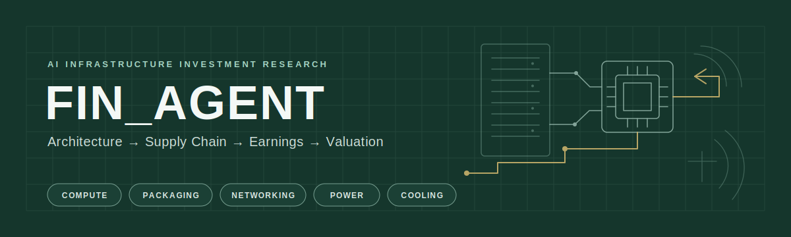

# fin_agent

> 從技術架構與產品週期出發，辨識 AI 基礎設施的供應鏈瓶頸、價值轉移與尚未定價的投資機會。

`Compute` · `Advanced Packaging` · `Networking & Optics` · `Power & Cooling` · `AI Factory Infrastructure`

## 精選研究（Featured Research）

- **[800VDC × Kyber](https://sonnyshiau.github.io/fin_agent/800vdc-kyber-power-industry.html)** — 拆解 Kyber 電源架構、導入節奏與供應鏈價值重分配。
- **[Vera Rubin / Rubin Ultra Rack Map](https://sonnyshiau.github.io/fin_agent/vera-rubin-rack-map.html)** — 映射 NVIDIA 下一代 rack-scale 系統、關鍵元件與平台演進。
- **[CoWoS 2027](https://sonnyshiau.github.io/fin_agent/ai-supply-chain-cowos.html)** — 比較需求、產能與技術路線，定位先進封裝的真正瓶頸。

## 研究版圖（Research Coverage）

- **運算（Compute）**：AI GPU、ASIC、CPU 與 HBM 決定算力、記憶體頻寬及功耗密度。
- **先進封裝（Advanced Packaging）**：CoWoS、SoIC、CoPoS 與 ABF 把邏輯、記憶體和基板整合成可量產的運算模組。
- **網路與光學（Networking & Optics）**：CPO、NPO、LPO 與矽光子突破 scale-up／scale-out 頻寬、距離及能耗限制。
- **電力與散熱（Power & Cooling）**：800VDC、BBU 與液冷把高密度晶片轉化為可持續運作的 rack-scale 系統。
- **AI 工廠基礎設施（AI Factory Infrastructure）**：機櫃、網路、供電與冷卻共同落地於資料中心，系統瓶頸會反向決定各環節的需求與議價權。

研究從整體架構定位瓶頸，再追蹤供應鏈價值量與稀缺性，連結基本面與 EPS，最後以估值、催化劑及 Thesis Broken 條件檢驗投資報酬。

## 研究方法（Research Framework）

1. **技術架構（Architecture）** — 先建立晶片、模組、機櫃、網路、電源與冷卻的完整系統架構。
2. **產品週期（Product Cycle）** — 追蹤平台 roadmap、設計變更、量產節點與 12–18 個月領先指標。
3. **供應鏈（Supply Chain）** — 映射零組件價值量、供應商、市占率、產能、認證、良率與瓶頸。
4. **基本面（Fundamentals）** — 將 design win、滲透率與產品組合連結至營收、利潤率、EPS、FCF 與 Capex。
5. **估值（Valuation）** — 以 Bear／Base／Bull Case 區分已定價與未定價假設，設定催化劑與 Thesis Broken 條件。

## 已發布研究（Published Research）

- [800VDC × Kyber 電源產業投資研究](https://sonnyshiau.github.io/fin_agent/800vdc-kyber-power-industry.html) — 800VDC 架構、Kyber 導入與電源供應鏈情境分析。
- [Vera Rubin / Rubin Ultra Rack 架構圖](https://sonnyshiau.github.io/fin_agent/vera-rubin-rack-map.html) — NVIDIA 下一代 AI rack-scale 架構與支援系統地圖。
- [AI Supply Chain: CoWoS 2027 Bottleneck](https://sonnyshiau.github.io/fin_agent/ai-supply-chain-cowos.html) — 2027 年 CoWoS 需求、產能分配與技術路線比較。
- [Bloom Energy Interview Brief](https://sonnyshiau.github.io/fin_agent/be-interview/) — Oracle 採用邏輯與 CSP 規模化部署門檻。
- [Retirement Calculator](https://sonnyshiau.github.io/retirement-calculator/) — 資產累積、提領節奏與退休規劃情境試算。

## 證據紀律（Evidence Discipline）

**證據來源（由高至低信心）：** 官方揭露（Official Disclosure）→ 公司指引（Company Guidance）→ 券商預估（Broker Estimate）→ 供應鏈調查（Channel Check）→ 市場傳聞（Market Rumor）

**分析輸出：** 獨立推論（Independent Inference），明確揭露假設、資料矛盾與推論邊界。

所有結論都標示證據層級；不把傳聞包裝成事實，不以單一樂觀假設代替交叉驗證，資料不足時明確註記缺口。
